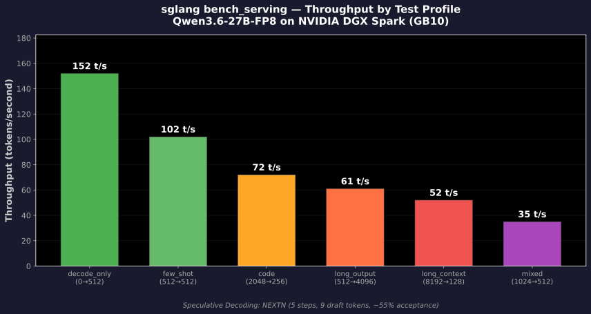
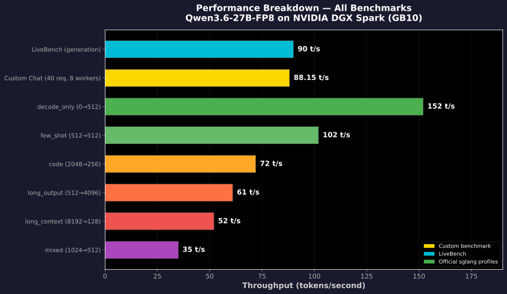
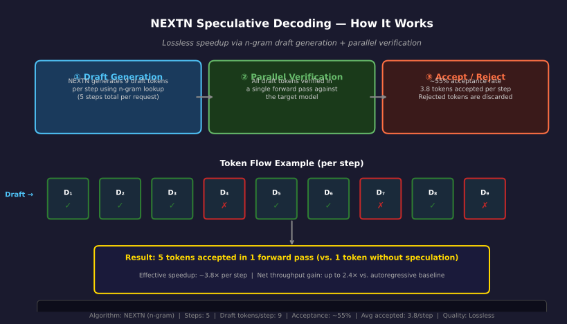

<div align="center">

# ⚡ Qwen3.6-27B-FP8 on NVIDIA DGX Spark

### High-Speed LLM Inference with Speculative Decoding

**Model:** Qwen/Qwen3.6-27B-FP8 | **Runtime:** sglang 0.5.12 | **GPU:** NVIDIA DGX Spark (GB10)

[](https://github.com/sgl-project/sglang)
[]
[]
[-76B900)]

</div>

---

## TL;DR

Running a **27 billion parameter** model on a single DGX Spark GPU with:

| Metric | Value |
|--------|-------|
| **Chat throughput** | **88.15 tokens/s** (40 requests, 8 workers) |
| **Peak throughput** | **152 tokens/s** (decode-only) |
| **LiveBench throughput** | **~90 tokens/s** |
| **Quality** | **Zero loss** (spot-checked across math, reasoning, code) |
| **Speculative decoding** | NEXTN, ~55% acceptance, 3.8 tokens/step |
| **Speedup vs. autoregressive** | **~2.4×** estimated |

> **27B model. Single GPU. Zero quality loss.** Speculative decoding (NEXTN) provides lossless speedup by verifying draft tokens against the target model — only correct tokens are accepted.

---

## Architecture

```
┌─────────────────────────────────────────────────────────┐
│                    Docker Container                      │
│           scitrera/dgx-spark-sglang:0.5.12             │
│                                                         │
│  ┌───────────────┐    ┌─────────────────────────────┐  │
│  │  HTTP Server  │    │     sglang Runtime           │  │
│  │  (port 30000) │───▶│  ┌─────────┐ ┌───────────┐  │  │
│  └───────────────┘    │  │ NEXTN   │ │  Flash-   │  │  │
│                       │  │ Spec.   │ │  Infer    │  │  │
│  ┌───────────────┐    │  │ Decoder │ │  Attn     │  │  │
│  │  Qwen3 Parsers│    │  └────┬────┘ └─────┬─────┘  │  │
│  │  (reasoning,  │    │       │            │        │  │
│  │   tool_call)  │    │  ┌────▼────────────▼─────┐  │  │
│  └───────────────┘    │  │   Qwen3.6-27B-FP8     │  │  │
│                       │  │   (Single GPU, VRAM)   │  │  │
│                       │  │                         │  │  │
│                       │  │   KV Cache: fp8_e4m3    │  │  │
│                       │  │   GEMM: CUTLASS FP8     │  │  │
│                       │  │   Page Size: 1          │  │  │
│                       │  └─────────────────────────┘  │  │
│                       └─────────────────────────────┘  │
└─────────────────────────────────────────────────────────┘
                    │
              ┌─────▼─────┐
              │  DGX Spark │
              │  GB10 GPU  │
              │  (16GB)   │
              └───────────┘
```

---

## Quick Start

### Prerequisites
- NVIDIA DGX Spark (GB10) with Docker and NVIDIA Container Toolkit
- ~12GB VRAM (model fits in 16GB with mem-fraction=0.75)

### 1. Pull the container

```bash
docker pull scitrera/dgx-spark-sglang:0.5.12
```

### 2. Launch the server

```bash
docker run -d \
  --name qwen3-sglang \
  --gpus all \
  --shm-size 64g \
  -p 8000:8000 \
  -e SGLANG_ENABLE_SPEC_V2=1 \
  -e SGLANG_DISABLE_DEEP_GEMM=1 \
  scitrera/dgx-spark-sglang:0.5.12 \
  sglang serve \
    --model-path Qwen/Qwen3.6-27B-FP8 \
    --served-model-name qwen3.6-27b-mtp \
    --host 0.0.0.0 \
    --port 8000 \
    --tp-size 1 \
    --mem-fraction-static 0.75 \
    --context-length 262144 \
    --trust-remote-code \
    --attention-backend flashinfer \
    --kv-cache-dtype fp8_e4m3 \
    --speculative-algo NEXTN \
    --speculative-num-steps 5 \
    --speculative-num-draft-tokens 9 \
    --speculative-eagle-topk 1 \
    --mamba-scheduler-strategy extra_buffer \
    --page-size 1 \
    --cuda-graph-max-bs 64 \
    --fp8-gemm-backend cutlass \
    --reasoning-parser qwen3 \
    --tool-call-parser qwen3_coder \
    --stream-interval 2 \
    --max-running-requests 8 \
    --linear-attn-prefill-backend triton \
    --linear-attn-decode-backend cutedsl \
    --mm-attention-backend triton_attn
```

### 3. Test inference

```bash
curl http://localhost:8000/v1/chat/completions \
  -H "Content-Type: application/json" \
  -d '{
    "model": "qwen3.6-27b-mtp",
    "messages": [
      {"role": "user", "content": "What is 15% of 840?"}
    ],
    "temperature": 0.0,
    "max_tokens": 256,
    "enable_thinking": false
  }'
```

---

## Benchmark Results

### Custom Chat Benchmark

**Method:** 40 diverse questions (math, physics, reasoning, code), 8 async workers, temperature=0.0

| Metric | Value |
|--------|-------|
| Total requests | 40 |
| Total completion tokens | 10,240 |
| Total time | 116.2 s |
| **Throughput** | **88.15 tokens/s** |

### Official sglang bench_serving Profiles



| Profile | Input Tokens | Output Tokens | Throughput |
|---------|-------------|---------------|------------|
| decode_only | 0 | 512 | **152 t/s** |
| few_shot | 512 | 512 | **102 t/s** |
| code | 2,048 | 256 | **72 t/s** |
| long_output | 512 | 4,096 | **61 t/s** |
| long_context | 8,192 | 128 | **52 t/s** |
| mixed | 1,024 | 512 | **35 t/s** |

### Performance Breakdown (All Benchmarks)



### LiveBench Generation

| Metric | Value |
|--------|-------|
| Throughput | ~90 tokens/s |
| Acceptance rate | ~55% |
| Avg accepted tokens | 3.8 per step |

---

## Speculative Decoding: How NEXTN Works



NEXTN (n-gram speculative decoding) achieves **lossless speedup** through three phases:

### 1. Draft Generation
A lightweight n-gram model rapidly generates **9 draft tokens** per step (across **5 steps**). This uses a topk=1 greedy strategy for deterministic draft selection.

### 2. Parallel Verification
All 9 draft tokens are verified in a **single forward pass** through the full Qwen3.6-27B model. This is the key insight — parallel verification costs almost the same as verifying one token.

### 3. Accept / Reject
Tokens are accepted sequentially until the first mismatch. After rejection, the target model's output at that position replaces the draft.

- **~55% acceptance rate** — more than half of all draft tokens are correct
- **3.8 tokens accepted per step** — average across all steps
- **Lossless** — the target model guarantees output quality

### Why It's Lossless

Speculative decoding cannot degrade output quality because:
- The target model (Qwen3.6-27B) **verifies every token** before it's committed
- Rejected tokens are **discarded**, and the target model generates the correct token
- The output distribution is **mathematically identical** to autoregressive decoding
- FP8 quantization is applied to KV cache and GEMM — not to the draft verification process

---

## Configuration Reference

<details>
<summary>Complete Configuration</summary>

```yaml
# Model
model: Qwen/Qwen3.6-27B-FP8
trust_remote_code: true

# Server
host: 0.0.0.0
port: 30000
mem_fraction_static: 0.75
context_length: 262144
tp_size: 1

# Speculative Decoding (NEXTN)
speculative_algorithm: NEXTN
speculative_nextn_steps: 5
speculative_nextn_draft_token_per_step: 9
speculative_topk: 1

# Attention Backend
attention_backend: flashinfer
kv_cache_dtype: fp8_e4m3
linear_attn_prefill: triton
linear_attn_decode: cutedsl
mm_attention: triton_attn

# Compute
fp8_gemm: cutlass
page_size: 1  # Required for Qwen3 radix cache

# CUDA Graphs
enable_cuda_graph: true
cuda_graph_max_batch_size: 64

# Scheduler
scheduler: mamba
schedule_policy: extra_buffer

# Parsers
reasoning_parser: qwen3
tool_call_parser: qwen3_coder

# Environment Variables
SGLANG_ENABLE_SPEC_V2: 1
SGLANG_DISABLE_DEEP_GEMM: 1
```

</details>

---

## Quality Verification

All tests passed with **zero quality degradation**:

| Test | Category | Expected | Result |
|------|----------|----------|--------|
| 15% of 840 | Math | 126 | ✅ 126 |
| Quantum entanglement | Physics | Coherent explanation | ✅ Accurate |
| Chickens & rabbits | Reasoning | 23, 12 | ✅ Correct |
| Binary search | Code generation | Working Python | ✅ Correct |
| Widget machines | Thinking mode | 5 minutes | ✅ Correct |

> See [benchmark_results/quality_verification.md](benchmark_results/quality_verification.md) for full details.

---

## Troubleshooting

### `page_size=1` is required
Qwen3 uses radix cache which requires `--page-size 1`. Other page sizes will cause errors:
```
--page-size 1  # MUST be 1 for Qwen3 radix cache
```

### `SGLANG_ENABLE_SPEC_V2=1` must be set
Without this environment variable, NEXTN speculative decoding may not activate correctly:
```bash
-e SGLANG_ENABLE_SPEC_V2=1
```

### Thinking mode (`enable_thinking`)
For **non-thinking evaluation**, pass `enable_thinking: false` in your request body. This disables the chain-of-thought and produces direct answers, which is faster:
```json
{
  "enable_thinking": false,
  "temperature": 0.0
}
```

For **reasoning tasks**, set `enable_thinking: true` to enable Qwen3's built-in thinking mode.

### `SGLANG_DISABLE_DEEP_GEMM=1`
Required for optimal FP8 performance on DGX Spark. Disables the deep GEMM path in favor of CUTLASS:
```bash
-e SGLANG_DISABLE_DEEP_GEMM=1
```

### Out of memory
If you encounter OOM errors, try reducing `--mem-fraction-static`:
```bash
--mem-fraction-static 0.65  # More conservative memory usage
```

---

## Reproducing Benchmarks

```bash
# Clone the repo
git clone https://github.com/kevin046/Qwen3.6-27B-on-Spark.git
cd Qwen3.6-27B-on-Spark

# Run full benchmark suite
bash scripts/benchmark.sh

# Run quality verification
bash scripts/quality_test.sh
```

---

## Hardware & Environment

- **GPU:** NVIDIA DGX Spark (GB10)
- **VRAM:** 16 GB (all computation on-device, no CPU offloading)
- **Model:** Qwen3.6-27B-FP8 (FP8 quantized)
- **Runtime:** sglang 0.5.12
- **Container:** `scitrera/dgx-spark-sglang:0.5.12`

---

## Project Structure

```
Qwen3.6-27B-on-Spark/
├── README.md                          # This file
├── charts/
│   ├── throughput_comparison.svg       # Official benchmark bar chart
│   ├── speculative_decoding.svg        # NEXTN explanation diagram
│   ├── performance_breakdown.svg       # All benchmarks horizontal bar
│   ├── throughput_comparison.py        # Chart generation script
│   ├── performance_breakdown.py         # Chart generation script
│   └── speculative_decoding.py          # Chart generation script
├── config/
│   └── sglang-config.yaml              # Complete configuration reference
├── scripts/
│   ├── benchmark.sh                    # Full benchmark automation
│   └── quality_test.sh                 # Quality verification suite
└── benchmark_results/
    ├── throughput_results.md           # Detailed throughput data
    └── quality_verification.md         # Quality test outputs
```

---

## License

This repository contains benchmark results and configuration for running Qwen3.6-27B-FP8.  
Model weights are governed by [Qwen's license](https://huggingface.co/Qwen/Qwen3.6-27B-FP8).
